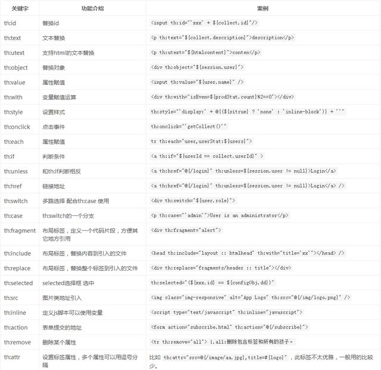

# SSH-Spring-Security-Thymeleaf

### 環境
- java8
- spring boot 2.3.1
- mysql 8


### thymeleaf
</img>

1.th:id:類似html標籤中的id屬性。
2.th:text:與th:utext:
即文本顯示，可對表達式或變量求值，並將結果顯示在其被包含的HTML標籤內，替換原有HTML文本。這裡需要與th:utext:區分開，th:text:例子如下：

若 restraunt.welcome=welcome to our <b>delicious</b>restaurant! 那麼，用 <p h:text="#{restaurantt.welcome}"></p> 解析的結果為： welcome to our <b>delicious</b>restaurant! ，

也就是說，會輸出 welcome to our &lt;b&gt;delicious&lt;/b&gt;restaurant</> 當然，我們是不會希望頁面上出現&lt;和e&gt;的，這時候，我們就需要使用th:utext:來進行轉義，即用 <p h:utext="#{restaurant.welcome}"></p>

所以最終輸出的結果為：welcome to our delicious restaurant!

3.th:object：

用於表單數據對象綁定，將表單綁定到後台controller的一個JavaBean參數,常與th:field一起使用進行表單數據綁定。選擇表達式一般跟在th:object後，直接取object中的屬性。

這裡有一個需要注意的點：*{...}表達式的值是在選定的對象而不是整個context的map。也就是說，如果沒有選定的對象，*{...}和${...}沒有區別，請看下面的例子：

```html
<div th:object="${session.user}">
    <p>姓名：<span th:text="*{Name}">noodles</span></p>
    <p>年齡：<span th:text="*{age}">24</span></p>
    <p>國籍：<span th:text="*{nationlity}">中國</span></p>
</div>
```

上面這段代碼相當於：

```html
<div>
    <p>姓名：<span th:text="${session.user.Name}">noodles</span></p> 
```

4.th:field：上面提到了一個新標籤，th:field：，常用於表單欄位綁定。通常與th:object一起使用。 屬性綁定、集合綁定。

```html
<form th:action="@{/bb}" th:object="${user}" method="post" th:method="post">
    <input type="text" th:field="*{name}"/>
    <input type="text" th:field="*{msg}"/>
    <input type="submit"/>
</form>

```

5.th:action:定義後台控制器路徑，類似<form>標籤的action屬性。

```html
<form action="subscribe.html" th:action="@{/subscribe}">
```

6.th：href:定義超連結，類似a標籤的href 屬性。value形式為@{/logout}.

```html
<!-- 輸出： 'http://localhost:8080/gtvg/order/details?orderId=3' -->
<a href="details.html" 
   th:href="@{http://localhost:8080/gtvg/order/details(orderId=${o.id})}">view</a>

<!-- 輸出： '/gtvg/order/details?orderId=3' -->
<a href="details.html" th:href="@{/order/details(orderId=${o.id})}">view</a>

<!-- 輸出： '/gtvg/order/3/details' -->
<a href="details.html" th:href="@{/order/{orderId}/details(orderId=${o.id})}">view</a>

```
7.th：src:用於外部資源引入，類似於script標籤的src屬性，常與@{}一起使用。

``<script th:src="@{/js/jquery/jquery-2.4.min.js}">``

8.th:value:用於標籤賦值，類似option標籤的value屬性。

```
<option th:value="soup">soup</option>

<input  id="msg" th:value="${msg}" />
```
9.th:if or th:unless：條件判斷,支持布爾值，數字（非零為true)，字符，字符串等.

```
<div th:if="${restaurant.index} == 0">... I love eating(do something at here) ...</div>

<span th:if="${food.price lt 100}" class="offer">Special desert!</span>    /*不能用"<"，">"等符號，要用"lt"等替代*/

<select class='form-control' name="skill[4].proficiency">
     <option >掌握程度</option>
     <option th:if="${skill.level eq '一般'}" th:selected="selected">一般</option>
     <option th:if="${skill.level eq '熟練'}" th:selected="selected">熟練</option>
     <option th:if="${skill.level eq '精通'}" th:selected="selected">精通</option>
</select>

```
這裡有兩個需要注意的點：先看下面兩行代碼，

```
<div th:if="${user.isAdmin} == false"> ...
<div th:if="${user.isAdmin == false}"> ...
```
在這個例子中，==false是寫在了\({...}的外邊，所以使Thymeleaf本身在支持它，如果寫在了\){...}的裡邊，則變為由OGNL或SpringEL庫來支持它。（***這裡目前我還未明白是什麼意思，希望明白的大神能告訴我這個問題***）

而null值也可以這麼使用：

``<div th:if="${variable.something} == null"> ...　　``　
th:if不光可以使用布爾值，以下規則都可以：

如果值不為空：如果值為null，th:if將為false
如果值為布爾型並且為true
如果值為數值型並且不為0
如果值為character並且不為0
如果值為String，並且不為"false","off"和"no"
如果值不為布爾型，數值型，character或String的任意類型
● 如果值為null，th:if將為false

th:if還有一個互逆的表達式為th:unless,還繼續用之前的例子作一個演示：

```
<a href="comments.html"
th:href="@{/comments(prodId=${prod.id})}" 
th:unless="${#lists.isEmpty(prod.comments)}">查看</a>

```

下面的是一個th：if 例子，大家可以照著套一下。

```html
<table>
    <tr>
        <th>食物名稱</th>
        <th>食物價格</th>
        <th>可現做</th>
        <th>食客評價</th>
    </tr>
    <tr th:each="prod:${prods}">
        <td th:text="${prod.name}">醋溜土豆絲</td>
        <td th:text="${#numbers.formatDecimal(prod.price,0,2)}">2.41</td>
        <td th:text="${prod.isReady}?#{true}:#{false}">yes</td>
        <td>
 <span th:text=${#lists.size(prod.comments)}>2</span>個評價
 <a href="comments.html" th:href="@{/product/comments(prodId=${prod.id})}"
 th:if="${not #lists.isEmpty(prod.comments)}">查看</a>
        </td>
    </tr>
</table>
```

如果產品有評論，那麼我們就創建一個跳轉到評論頁面的超連結，並且使用產品ID作為參數。

10.th:switch 和th:case:選擇語句。 th:case="*"表示default case。注意：一旦一個th:case被判斷為真，那麼其他的同等級的th:case都將被判斷為假

```html
<div th:switch="${user.role}">
  <p th:case="'admin'">超級管理員用戶</p>
  <p th:case="#{roles.manager}">管理員用戶</p>
  <p th:case="*">其他用戶</p>
</div>
```

11.th:with:定義變量，th:with="isEven=${prodStat.count}%2 == 0"，定義多個變量可以用逗號分隔。


```html
<div th:with="firstPer=${persons[0]}">
  <p>
    The name of the first person is <span th:text="${firstPer.name}">Julius Caesar</span>.
  </p>
</div>

```
當th:with被處理,firstPer變量創建一個局部變量和變量添加到map自上下文,以便它是用於評估和其他上下文中聲明的變量從開始,但只有包含div標記的範圍內。

```html
div th:with="firstPer=${persons[0]},secondPer=${persons[1]}">
  <p>
    The name of the first person is <span th:text="${firstPer.name}">Julius Caesar</span>.
  </p>
  <p>
    But the name of the second person is 
    <span th:text="${secondPer.name}">Marcus Antonius</span>.
  </p>
</div>

```
th:with屬性允許重用變量定義在相同的屬性:

``<div th:with="company=${user.company + ' Co.'},account=${accounts[company]}">...</div>``
12.th:remove:移除除了第一個外的靜態數據，用第一個tr標籤進行循環疊代顯示:

```html
<tbody th:remove="all-but-first">
 //將後台傳出的 productList 的集合進行疊代，用product參數接收，通過product訪問屬性值
 <tr th:each="product:${productList}">
 //用count進行統計，有順序的顯示
	 <td th:text="${productStat.count}">1</td>
	 <td th:text="${product.description}">Red Chair</td>
	 <td th:text="${'$' + #numbers.formatDecimal(product.price, 1, 2)}">$123</td>
	 <td th:text="${#dates.format(product.availableFrom, 'yyyy-MM-dd')}">2014-12-01</td>
 </tr>
 <tr>
	 <td>White table</td>
	 <td>$200</td>
	 <td>15-Jul-2013</td>
 </tr>
 <tr>
	 <td>Reb table</td>
	 <td>$200</td>
	 <td>15-Jul-2013</td>
 </tr>
 <tr>
	 <td>Blue table</td>
	 <td>$200</td>
	 <td>15-Jul-2013</td>
 </tr>
      </tbody>
```

原文網址：<a href="https://kknews.cc/code/y8barvk.html">https://kknews.cc/code/y8barvk.html</a>


### @ModelAttribute

1.用在控制器的方法上：

每次執行方法時都會先執行@ModelAttribute註解的方法，放入結果添加到model中

```java

@ModelAttribute("top")
public Map top(){
    return pageTop.getDataMap();
}

@RequestMapping({"", "/", "/home"})
public String home(@RequestBody(required = false) Map<String, Object> param, Model model) {
    model.addAttribute("model", dataAssembly.homePageData(param));
    return "home";
}
```
執行home（）前先執行top（）將頂部模塊數據放到模型。
在首頁返回的視圖中包含top值，可以直接在頁面獲取。

2.用在方法的参數上：


```java
@RequestMapping("/test")
public String test(@ModelAttribute("top") Map top, Model model) {
    JSONArray ja  = JSONArray.fromObject(map);
    return "test";
}


```
可以直接從參數中取值

3.用在ControllerAdvice的方法中：

```java

@ControllerAdvice
public class GlobalModelData {
    @ModelAttribute
    public Object globalUser() {
        User user = new User();
        user.setUn("xxx");
        return user;
        *//*这里在controller执行前将返回值填充到model中,则可以在model中获取数据*//*
    } 
}

```

每個Controller中的方法執行前都會先執行@ModelAttribute註解標註的方法，將返回值添加到model

